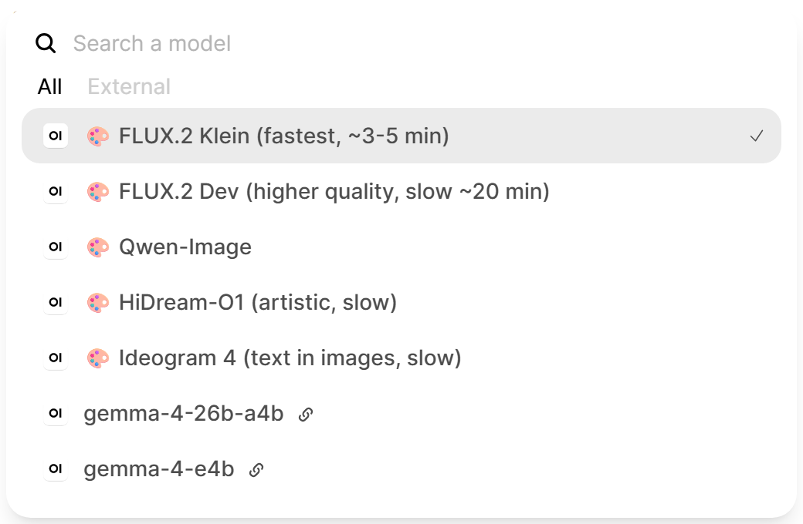

# Open WebUI image models via llama-swap

Add image-generation models to [Open WebUI](https://github.com/open-webui/open-webui) as **selectable entries in the model dropdown**. Pick one, type a prompt, get an image in the chat. Each model is routed to the right backend **through [llama-swap](https://github.com/mostlygeek/llama-swap)**, so a single GPU is shared safely between your chat LLMs and your image models (llama-swap loads one model at a time, so no out-of-memory).



This is a single Open WebUI **Function** (a manifold "pipe"). No fork, no extra service, no second inference engine.

## Why

Open WebUI's built-in image generation targets one global model at a time, and you cannot choose the model per chat. If you serve several image models behind llama-swap (FLUX, Qwen-Image, HiDream, an Ideogram-style HTTP backend, and so on), this function exposes each of them as its own selectable model and routes the request to the correct backend. Your chat history becomes your gallery.

## How it works

```
you pick a model + prompt
        |
        v
   Open WebUI  --(this function)-->  llama-swap  -->  the right backend
                                                  |
                                                  +-- ComfyUI (builds a workflow)
                                                  |     POST /upstream/<name>/prompt
                                                  |
                                                  +-- OpenAI-style image API
                                                        POST /upstream/<name>/v1/images/generations
```

- **`comfyui` backend**: the function builds a ComfyUI prompt graph from a built-in template (`flux2`, `qwen_image`, `hidream`, `sdxl`), posts it to `<llama-swap>/upstream/<name>/prompt`, polls `/history`, and fetches the image from `/view`.
- **`openai` backend**: the function posts `{prompt, size}` to `<llama-swap>/upstream/<name>/v1/images/generations` (any OpenAI-images-compatible server behind llama-swap).

The finished image is uploaded to Open WebUI's own file store and the chat gets a link to it (`/api/v1/files/<id>/content`). The link is relative, so the browser fetches the image from Open WebUI itself and it works even when the browser cannot reach llama-swap directly. Your chat history is the gallery.

## Requirements

- [Open WebUI](https://github.com/open-webui/open-webui) 0.5 or newer.
- [llama-swap](https://github.com/mostlygeek/llama-swap) in front of your image backends, with each image model reachable at `/upstream/<model-name>/...`. ComfyUI is run as a llama-swap model; OpenAI-style image servers too. This keeps one GPU coordinated across chat and image models.

You do not need any extra Python packages: the function only uses `aiohttp` and `pydantic`, which Open WebUI already bundles.

## Install

### Option A: paste into Open WebUI (easiest)

1. Open Open WebUI, then **Admin Panel** > **Functions** > **+** (New Function).
2. Give it an id (for example `llamaswap_image_models`) and a name, then paste the contents of [`llamaswap_image_models.py`](llamaswap_image_models.py).
3. Save, then toggle the function **on**.
4. Configure it (see the next section). The models appear in the model dropdown.

### Option B: one command (API)

```bash
git clone https://github.com/mayerwin/open-webui-llamaswap-image-models
cd open-webui-llamaswap-image-models
./install.sh http://YOUR-OPEN-WEBUI:3000 YOUR_ADMIN_API_KEY
```

Get an API key in Open WebUI under **Settings** > **Account** > **API Keys** (the account must be an admin). The script creates the function if it is missing, updates it if it already exists, and activates it.

## Configure

In Open WebUI go to **Admin Panel** > **Functions** > your function > the **gear** icon (Valves):

- **`LLAMASWAP_URL`**: your llama-swap base URL (default `http://127.0.0.1:8080`).
- **`MODELS_JSON`**: the list of image models to expose. Replace the example with yours.
- **`TIMEOUT_S`**: max seconds to wait for one image (heavy models are slow; default 2400).
- **`WEBUI_URL`**: base URL of this Open WebUI, used to upload the generated image to its file store. Leave empty to auto-detect it from the incoming request; set it if your Open WebUI sits behind a proxy that rewrites the host.
- **`INLINE_IMAGES`**: return the image as a base64 data URI instead of a file-store link (off by default). Needs no auth, but see the note below on why it makes chats slow.

Each `MODELS_JSON` entry looks like this:

```json
{
  "id": "flux",
  "name": "FLUX.2 (fast)",
  "icon": "🎨",
  "backend": "comfyui",
  "upstream": "comfyui",
  "template": "flux2",
  "files": {
    "unet": "flux-2-klein-4b-Q4_K_M.gguf",
    "clip": "qwen_3_4b_fp4_flux2.safetensors",
    "vae":  "flux2-vae.safetensors"
  },
  "steps": 20,
  "guidance": 3.5,
  "description": "Describe the picture you want."
}
```

Field by field:

| field | meaning |
| --- | --- |
| `id` | unique id; becomes the model id in Open WebUI |
| `name` | label shown in the dropdown |
| `icon` | optional prefix (any emoji or text) |
| `backend` | `comfyui` or `openai` |
| `upstream` | the llama-swap model name to route to |
| `template` | `comfyui` only: `flux2`, `qwen_image`, `hidream`, or `sdxl` |
| `files` | `comfyui` only: the file names ComfyUI loads (keys depend on the template) |
| `steps`, `guidance` | `comfyui` only: defaults for this model |
| `description` | shown on the model's splash screen |

An `openai` backend entry is just the routing:

```json
{ "id": "ideogram", "name": "Ideogram 4", "icon": "🎨", "backend": "openai", "upstream": "ideogram-4" }
```

The built-in templates (`flux2`, `qwen_image`, `hidream`, `sdxl`) cover common ComfyUI graphs. `sdxl` is the stock single-checkpoint graph (`files: {"ckpt": "..."}`) and works for SD 1.5 / SDXL / any checkpoint that bundles unet+clip+vae. For a different model family, add a builder function near the top of the source and reference it by name from `template`.

### Make ComfyUI actually free the GPU (recommended)

llama-swap only knows a model is unloaded when its process exits. ComfyUI usually runs as a long-lived service, so by default it keeps the diffusion weights in VRAM after your image is done, and the next chat LLM can fail to load. The fix is to run ComfyUI as a llama-swap model whose `cmdStop` drains the queue, asks ComfyUI to free its memory, and only then stops:

```yaml
models:
  comfyui:
    proxy: http://localhost:8188
    checkEndpoint: /system_stats
    unlisted: true
    unloadTimeout: 180
    cmd: tail -f /dev/null
    cmdStop: |
      sh -c '
        # 1. wait for ComfyUI to finish whatever it is rendering (max ~60s)
        for i in $(seq 1 30); do
          response=$(curl -fsS --max-time 10 http://localhost:8188/prompt 2>/dev/null)
          if [ -n "$response" ]; then
            queue_remaining=$(echo "$response" | grep -o "\"queue_remaining\": [0-9]*" | cut -d " " -f 2)
            if [ -n "$queue_remaining" ] && [ "$queue_remaining" = "0" ]; then
              break
            fi
          fi
          sleep 2
        done
        # 2. tell ComfyUI to drop its models, and wait until the VRAM is really back
        vram_threshold=93
        for i in $(seq 1 60); do
          sleep 1
          curl -s -X POST http://localhost:8188/api/free -H "Content-Type: application/json" -d "{\"unload_models\": true, \"free_memory\": true}"
          sleep 2
          stats=$(curl -fsS --max-time 10 http://localhost:8188/api/system_stats 2>/dev/null)
          if [ -n "$stats" ]; then
            vram_total=$(echo "$stats" | grep -o "\"vram_total\": [0-9]*" | head -1 | cut -d " " -f 2)
            vram_free=$(echo "$stats" | grep -o "\"vram_free\": [0-9]*" | head -1 | cut -d " " -f 2)
            if [ -n "$vram_total" ] && [ -n "$vram_free" ] && [ "$vram_total" -gt 0 ] 2>/dev/null; then
              pct=$((vram_free * 100 / vram_total))
              if [ "$pct" -ge "$vram_threshold" ] 2>/dev/null; then
                sleep 2
                break
              fi
            fi
          fi
        done
        kill -TERM ${PID} 2>/dev/null || true
      '
```

Points to adapt:

- Replace `localhost:8188` with your ComfyUI address (it appears four times).
- `cmd: tail -f /dev/null` is a placeholder process for a ComfyUI you start yourself (systemd, Docker, ...). If you let llama-swap launch ComfyUI, put the real launch command in `cmd` instead; `cmdStop` is unchanged and `${PID}` still refers to it.
- `vram_threshold=93` means "consider ComfyUI done once 93% of VRAM is free". Lower it if you have something else resident on the card, or it will spin for the full 60 iterations.
- The queue check keeps llama-swap from yanking the GPU out from under a render that is still in progress.

Thanks to [@jamilnielsen](https://github.com/jamilnielsen) for working this out; the original is in [llama-swap discussion #962](https://github.com/mostlygeek/llama-swap/discussions/962#discussioncomment-17847983).

### Tidy up (optional)

Disable Open WebUI's built-in image toggle so it does not compete with these models: **Admin Panel** > **Settings** > **Images** > turn **Image Generation** off. This function does not use it.

## Use

Pick a model in the dropdown, type a description, and send. Optional inline flags in the prompt:

```
a red fox in a snowy forest --steps 30 --size 1216x832 --seed 7 --neg "blurry, low quality"
```

Or set per-user defaults in the function's UserValves (width, height, steps, seed, negative).

## Notes and troubleshooting

- **Open WebUI may run Python older than 3.12.** There, a backslash inside an f-string expression is a `SyntaxError`, and it crashes the function load with HTTP 400. If you edit the source, keep escapes (like the emoji) in module constants, never inline in an f-string. This repo already follows that rule.
- **Heavy models are slow.** A large diffusion model on a modest GPU can take many minutes per image; the function streams a "rendering... Ns" status while it waits. Raise `TIMEOUT_S` if a model needs longer.
- **Images go to Open WebUI's file store, not into the chat as base64.** A data URI is re-sent with the whole conversation on every later message, so a chat with a few images becomes slow to load and unpleasant to keep talking in. Two details make the upload work, and both were dead ends at first: the route needs the **trailing slash** (`POST /api/v1/files/` — without it the request matches the `GET` listing and returns 405), and it needs **`?process=false`** to skip the document-extraction pipeline, which is what hangs on an image. Credit to [@jamilnielsen](https://github.com/mayerwin/open-webui-llamaswap-image-models/issues/2) for finding this.
- **If the upload fails, the image is not lost.** The function falls back to an inline data URI and says so in the status line. Set `INLINE_IMAGES` to make that the permanent behaviour.
- **Generated images accumulate in Open WebUI's upload folder.** That is the trade-off for fast chats; prune it if disk matters.
- **Several images at once in one chat.** Sending a new prompt while one is still rendering can abandon the in-flight render — an Open WebUI limitation this function cannot work around. Use separate chats for parallel requests.
- **Nothing in the dropdown?** Check that the function is toggled on, that `MODELS_JSON` is valid JSON, and that each entry has an `id`.

## License

MIT. See [LICENSE](LICENSE).
